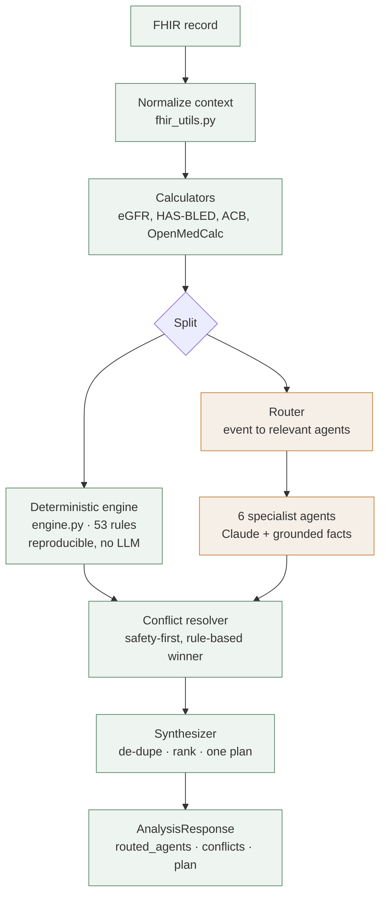

# Kapsule — Architecture

High-level design of the medication-intelligence backend: how the pipeline is
layered, how each LLM agent makes its decisions, and how the system is kept
grounded so it doesn't hallucinate.

## The one idea to remember

Every reasoning source in Kapsule — a hard-coded rule or an LLM agent — emits the
**same object**, a `Recommendation` (`tier · action · order_target · rationale ·
confidence · evidence[]`). That shared contract is what lets a deterministic rule
and a model's judgment be compared, reconciled, and merged as if they came from
one place.

Two layers produce those recommendations:

- **Deterministic engine** — hard-coded clinical rules. No model, no randomness.
  Same input → identical output. This is the reproducible, auditable floor.
- **Six LLM agents** — Claude reasoning as clinical specialists. This adds
  guideline narrative, taper plans, trial citations, and judgment rules can't
  encode.

The LLM sits in the **middle** of the pipeline, bracketed on both sides by
deterministic code: deterministic facts flow *in* (normalize → calculators →
engine), agents reason over those facts in parallel, and deterministic logic
reconciles and ranks what comes back *out*.

## Architecture



Plain-text view of the same flow:

```
FHIR record
   -> normalize (deterministic)
   -> calculators (deterministic)
   -> SPLIT
        |-- deterministic engine  (53 rules, reproducible)  --|
        |-- router -> 6 LLM agents (Claude, grounded)        --|
                                                               v
                                    conflict resolver (rule-based winner)
                                                               v
                                    synthesizer (rank + merge, one plan)
                                                               v
                                    AnalysisResponse
```

Green = deterministic. Amber = LLM.

## What is deterministic vs. LLM

| Component | File | Deterministic? |
|---|---|---|
| Load dataset | `data.py` | Yes |
| Normalize FHIR → context | `fhir_utils.py` | Yes |
| Local calculators (eGFR, HAS-BLED, ACB, Child-Pugh, CHA₂DS₂) | `calculators.py` | Yes (pure math) |
| OpenMedCalc calculators (MELD-Na, Wells, Caprini) | `calculators.py` | External API; skipped if unreachable |
| **Reasoning engine** (interactions, burden, duplicates, cautions, indications) | `engine.py` | **Yes — same input, identical output** |
| Drug library + fuzzy search | `drug_library.py` | Yes |
| Evidence resolver (label → verified URL) | `evidence.py` | Yes |
| Router (event → agents) | `router.py` | Yes |
| **Six specialist agents** | `agents/` | **No — Claude** |
| Conflict resolver — *winner selection* | `conflict_resolver.py` | Yes (rule-based) |
| Conflict resolver — *reconciliation sentence* | `conflict_resolver.py` | LLM (deterministic fallback) |
| Synthesizer — *ranking + monitoring list* | `synthesizer.py` | Yes |
| Synthesizer — *two summary paragraphs* | `synthesizer.py` | LLM (deterministic fallback) |

The important nuance: even in the resolver and synthesizer, the **decisions**
(which recommendation wins a conflict, how the plan is ranked) are rule-based.
The model only writes the explanatory prose.

## How each LLM agent decides

All six agents share one loop (`BaseAgent.run`); they differ only in their
specialist prompt and which calculators they read.

1. **Get the right facts.** The agent receives a compact clinical digest plus a
   pre-computed calculator block — e.g. Dose Intelligence reads eGFR + Child-Pugh;
   Risk Monitoring reads HAS-BLED + ACB. It never reasons from raw FHIR.
2. **Reason as a specialist.** A system prompt sets the lens and the rulebook the
   agent must apply.
3. **Return structured JSON only** — a list of recommendations matching the shared
   contract, which is parsed and validated into `Recommendation` objects.

What each agent is actually deciding:

- **Polypharmacy** — is any drug potentially inappropriate (Beers 2023,
  STOPP/START v3), duplicated, or a prescribing cascade? Produces stop/taper
  suggestions.
- **GDMT Optimization** — for each diagnosis (HFrEF, T2DM, CAD, CKD, AFib), is
  every guideline-directed therapy present and at target dose? Flags gaps and
  quantifies benefit (NNT/ARR).
- **Dose Intelligence** — is each dose safe for this patient's renal/hepatic
  function, age, and weight? Recommends adjusted doses.
- **Risk Monitoring** — what composite risks (QT, bleeding, hyperkalemia,
  hypoglycemia, falls) does the regimen carry, and what should be monitored, when?
- **Drug–Supplement** — what OTC/supplement interactions exist, graded by
  mechanism and severity; flags reconciliation gaps.
- **Cost Optimization** — is there a therapeutically-equivalent, lower-cost,
  formulary-preferred alternative?

Because they all emit the same contract, the downstream resolver can line up, for
example, GDMT's "start an MRA" against Risk Monitoring's "hold potassium-raising
agents" on the same drug and settle it safety-first.

## How hallucinations are prevented

Kapsule treats the LLM as a *reasoner over supplied facts*, not a *source of
facts*. Several guardrails enforce this:

1. **Grounding, not recall.** Agents are handed the patient's real values (labs,
   meds, computed eGFR) in the prompt and instructed to use only what's provided —
   "do not invent labs, doses, or diagnoses that are not present." They reason
   from the chart rather than from memory.

2. **Numbers come from deterministic code, not the model.** Every eGFR,
   anticholinergic-burden score, HAS-BLED, etc. is computed by real formulas and
   passed in. The model interprets those numbers; it never calculates them.

3. **A reproducible engine is the floor.** The most safety-critical findings
   (interactions, renal contraindications, hyperkalemia holds, duplicates) come
   from `engine.py`'s hard-coded rules and are identical on every run — no model
   involved. Even with zero API key, these still fire.

4. **Citations are resolved, never fabricated.** Evidence labels are mapped to
   **verified** PubMed / FDA / Choosing Wisely records by `evidence.py`. An
   unknown label resolves to a PubMed *search* link rather than a made-up PMID, so
   the UI never shows a fake citation.

5. **Strict output contract + validation.** Agents must return typed JSON; it's
   parsed, enum-coerced, and confidence-clamped. Anything malformed is dropped
   rather than displayed, and a per-agent failure never corrupts the run.

6. **Confidence + safety-first reconciliation.** Every recommendation carries a
   confidence score, and when agents disagree the resolver defaults to the safest
   action by rule — so an over-eager suggestion can't override a safety hold.

7. **Deterministic fallbacks everywhere the LLM is optional.** The resolver's
   winner and the synthesizer's ranking are computed without the model; if a
   summary call fails, a rule-built summary is used instead.

Net effect: the model adds clinical *narrative and judgment*, but the *facts, the
math, the citations, and the safety decisions* are all produced or gated by
deterministic code.

## Request lifecycle (one call)

`POST /patients/{id}/analyze`:

1. Normalize the record → context; render the digest.
2. Run calculators.
3. Run the deterministic engine (always).
4. Route to the relevant agents (by event, then specialty).
5. Run those agents concurrently (bounded), grounded in the digest + calculators.
6. Collect every recommendation (engine + agents).
7. Conflict resolver reconciles overlaps safety-first.
8. Synthesizer de-dupes, ranks, and writes the plan + patient summary.
9. Return routed agents, all results, conflicts, and the final plan.

*Synthetic data only. Not a validated clinical tool.*
